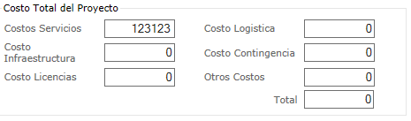

# Ejercicio

Para mayor información sobre los ejercicios siguientes consulte [los 30 selectores CSS que debes memorizar](https://code.tutsplus.com/es/tutorials/the-30-css-selectors-you-must-memorize--net-16048).

Se puede hacer individual o de a 2 o 3 estudiantes. El docente se reserva el derecho de llamar a sustentar cualquier estudiantes si se elabora por grupos. La nota de quien sustente, es la nota del grupo.

Tiempo: **una hora**.

- ## Todos los elementos de la página
~~~
    font-size: 16px;
    font-family: Arial, Helvetica, sans-serif;
~~~

- ## Todos los parrafos de la página
~~~
    color: #555;
~~~

- ## Todos los párrafos contenidos en `#primero`
~~~
    color: #369;
~~~

- ## Todos los enlaces la página
~~~
    color: #C30;
~~~

- ## Los elementos `<em>` contenidos en `#primero`
~~~
    color: #0000BB;
    background-color: #FFFFCC;
~~~

- ## Todos los elementos `<em>` con la clase `"especial"` en toda la página
~~~ 
    color: #FFFF00;
    background: #000000; 
~~~

- ## Todos los elementos `` contenidos en la clase `"normal"`
~~~
    font-weight: bold;
~~~

- ## Para los selectores que se dan a continuación agregue en `style.css` un color de fuente distinto o un mismo color en diferentes tonalidades y luego escribe en `index.html` el html que corresponda con los selectores css.
~~~
    .segundo {
        ...
    }

    p.segundo {
        ...
    }

    section.segundo {
        ...
    }

    #subtitulo { 
        ...
    }
    
    p#resaltado {
        ...
    }
    
    .segundo span { 
        ...
    }
    
    .segundo > span { 
        ...
    }
    
    span.segundo {
        ...
    }
~~~

## Agregue un formulario a la página
El formulario debe tener las entradas que se muestran en la figura siguiente, pero el estilo puede ser distinto.

Los ID de los campos de texto, de arriba a abajo y de izquierda a derecha son _exactamente_ los siguientes:
- costo-servicios
- costo-infraestructura
- costo-licencias
- costo-logistica
- costo-contingencias
- costos-varios
- total-costos